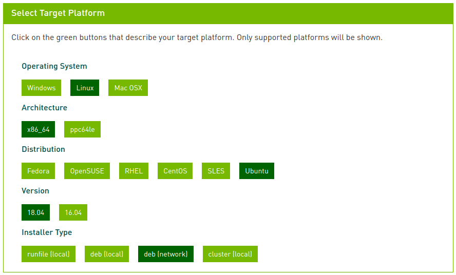
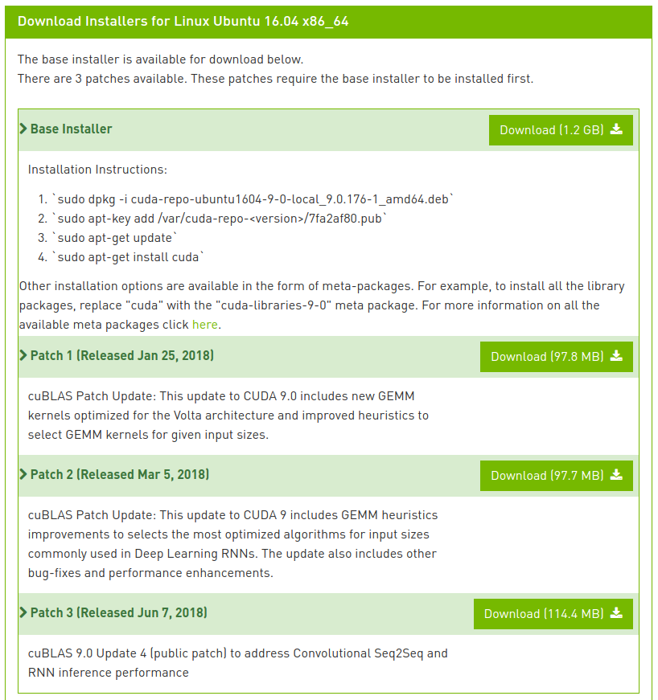

# Установка CUDA, TensorRT и cuDNN

#### 1. Скачиваем установщики

Страница загрузки [CUDA 9.0](https://developer.nvidia.com/cuda-90-download-archive)

В поле Select Target Platform выбираем все как показано на рисунке ниже.



Под полем Select Target Platforms появится еще одно поле с загрузками.

Скачиваем все 4 файла.



#### 2. Установка репозиториев CUDA

Необходимо в терминале перейти в папку, куда вы скачали установщики на прошлом шаге, например:

```
cd ~/Загрузки
```

Затем установить все скачанные пакеты командой:

```
sudo dpkg -i cuda-repo-ubuntu1604-9-0-local_9.0.176-1_amd64.deb cuda-repo-ubuntu1604-9-0-local-cublas-performance-update_1.0-1_amd64.deb cuda-repo-ubuntu1604-9-0-local-cublas-performance-update-2_1.0-1_amd64.deb cuda-repo-ubuntu1604-9-0-local-cublas-performance-update-3_1.0-1_amd64.deb
```

Это установит основной пакет с репозиторием и все патчи. 

После этого необходимо добавить ключи репозитория CUDA в систему, чтобы apt знал что репозиториям CUDA можно доверять.

```
sudo apt-key add /var/cuda-repo-9-0-local/7fa2af80.pub
```

Потом нужно обновить списки пакетов.

```
sudo apt update
```

#### 3. Установка CUDA Toolkit

Если вы самостоятельно не устанавливали драйвера для видеокарт Nvidia то можно использовать следующую команду:

```
sudo apt install cuda
```

Драйвера автоматически установятся в ходе установки пакета cuda. По окончании установки надо выполнить следующую команду для настройки драйверов и перезагрузить компьютер.

```
sudo nvidia-xconfig
```

Если вы самостоятельно установили необходимый вам драйвер для видеокарт Nvidia, то установку CUDA Toolkit нужно производить следующей командой

```
sudo apt install cuda-toolkit-9-0
```

Это установит только CUDA Toolkit и не будет трогать драйвера.

#### 4. Настройка окружения для работы с CUDA Toolkit

Все библиотеки, заголовочные файлы, необходимые для разработки и приложения CUDA Toolkit 9.0 хранятся в каталоге /usr/local/cuda-9.0/. Если вы попытаетесь запустить компилятор CUDA, с помощью команды nvcc, сразу после установки, система не сможет его найти. Поэтому необходимо добавить пути к библиотекам и исполняемым файлам CUDA Toolkit в соответствующие системные переменные.

```
# Объявим переменную, указывающую на основную папку CUDA

echo 'export CUDA_ROOT=/usr/local/cuda-9.0' >> ~/.bashrc 

# Добавим путь к исполняемым файлам CUDA Toolkit в системную переменную PATH, где находятся все пути для поиска исполняемых файлов

echo 'export PATH=$CUDA_ROOT/bin:$PATH' >> ~/.bashrc 

# Добавим путь к библиотекам CUDA Toolkit в системную переменную LD_LIBRARY_PATH, где находятся пути для поиска библиотек

echo 'export LD_LIBRARY_PATH=$CUDA_ROOT/lib64:$LD_LIBRARY_PATH' >> ~/.bashrc 
```

Проверить правильность действий можно открыв новый терминал и введя команду ` nvcc --version ` .
Вывод этой команды будет примерно таким:

```
$ nvcc --version

nvcc: NVIDIA (R) Cuda compiler driver
Copyright (c) 2005-2017 NVIDIA Corporation
Built on Fri_Sep__1_21:08:03_CDT_2017
Cuda compilation tools, release 9.0, V9.0.176
```

#### 5. Установка cuDNN

Скачиваем два пакета [cuDNN](https://developer.nvidia.com/rdp/cudnn-archive).

Runtime нужен для запуска программ с cuDNN.
Developer нужен для разработки программ с cuDNN.

Устанавливаем скачанные пакеты следующим образом:

```
cd ~/Загрузки

sudo dpkg -i libcudnn7_7.0.5.15-1+cuda9.0_amd64.deb libcudnn7-dev_7.0.5.15-1+cuda9.0_amd64.deb
```

#### 6. Установка TensorRT

Скачиваем пакет [TensorRT](https://developer.nvidia.com/nvidia-tensorrt3_download).
Нужен пакет for Ubuntu 16.04 and CUDA 9.0 DEB local repo packages.

Устанавливаем пакет по аналогии с пакетами CUDA:

```
cd ~/Загрузки

sudo dpkg -i nv-tensorrt-repo-ubuntu1604-ga-cuda9.0-trt3.0.4-20180208_1-1_amd64.deb

sudo apt update

sudo apt install tensorrt # Основной пакет

sudo apt install python-libnvinfer python-libnvinfer-dev python-libnvinfer-doc swig3.0 # Для python 2.7

sudo apt install python3-libnvinfer python3-libnvinfer-dev python3-libnvinfer-dev swig3.0 # Для python 3.5

sudo apt install uff-converter-tf # Для всех случаев
```