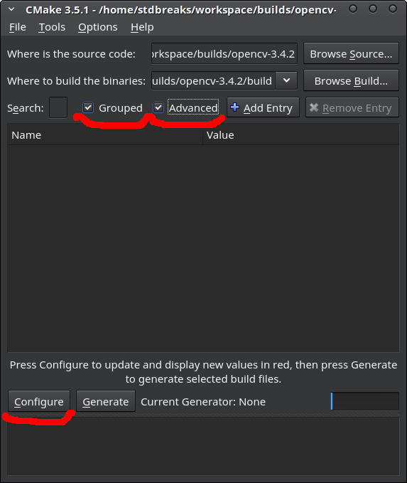

# Установка OpenCV 3.4

Если вы устанавливали ROS desktop или desktop-full, надо удалить версию OpenCV, которая ставится вместе с ROS иначе в Python будет доступен модуль OpenCV, установленный вместе с ROS:

```
sudo apt purge ros-kinetic-opencv3
```

#### 1. Установка зависимостей

```
# Компиляторы и вспомогательные утилиты и библиотеки

sudo apt install build-essential unzip cmake cmake-qt-gui python-dev pkg-config git libtbb2 libtbb-dev libopenblas-dev libgtk2.0-dev libgtk-3-dev libswscale-dev

# Для кодирования/декодирования изображений и видео

sudo apt install libjpeg-dev libpng-dev libtiff-dev libjasper-dev libx264-dev libx265-dev libavcodec-dev libavformat-dev libxvidcore-dev ffmpeg 

# Для работы с оборудованием захвата

sudo apt install libv4l-dev v4l-utils guvcview libdc1394-22-dev libgstreamer1.0-dev libgstreamer-plugins-base1.0-dev libgstreamer-plugins-good1.0-dev libgstreamer-plugins-bad1.0-dev
```

#### 2. Загрузка исходных кодов OpenCV

Исходные коды можно загрузить со страницы релизов OpenCV на github https://github.com/opencv/opencv/releases. Подойдет любая версия 3.4.x (на момент написания это 3.4.2).

Загрузить нужно файл по ссылке Source code (zip).

Скачанный архив распакуйте в удобную папку.

Помимо исходных кодов самой OpenCV понадобятся исходные коды дополнительных модулей для OpenCV. Могут быть загружены здесь https://github.com/opencv/opencv_contrib/releases.

Версия дополнительных модулей должна совпадать с версией скачанной OpenCV. Архив лучше скачать в формате zip.

Аналогично архиву с исходными кодами OpenCV распаковать в удобную папку, желательно рядом с OpenCV для удобства.

#### 3. Настройка OpenCV

В папке с исходными кодами OpenCV нужно создать папку build. Это можно сделать через файловый менеджер либо через терминал, с помощью команды `mkdir build` в папке с исходными кодами.

```
Например

cd ~/workspace/builds/opencv-3.4.2

mkdir build
```

Далее перейдем в созданную папку build и откроем ее в терминале (файловый менеджер -> пкм по пустому месту в папке -> открыть в терминале), через терминал:

```
Например

cd ~/workspace/builds/opencv-3.4.2/build
```

Теперь можно приступить к настройке с помощью cmake.

Запускаем графический интерфейс утилиты cmake следующей командой:

```
cmake-gui ..
```

Должно открыться окно как на рисунке ниже, в данном окне необходимо установить галочки Grouped и Advanced и затем нажать на кнопку Configure, появится окно с вопросом о компиляторе, оставляем все как есть и жмем Finish.



Как только завершится предварительная конфигурация можно приступать к настройке.

- подключение дополнительных модулей

Для подключения дополнительных модулей в окне утилиты cmake надо найти вкладку OPENCV и в ней пункты OPENCV_EXTRA_MODULES_PATH и OPENCV_ENABLE_NONFREE.

OPENCV_EXTRA_MODULES_PATH - путь к папке modules, которая лежит в папке с исходными кодами дополнительных модулей (opencv_contrib-3.4.x), которую вы скачали и распаковали на шаге 2.

OPENCV_ENABLE_NONFREE - ставим галочку если хотите, чтобы в opencv была поддержка несвободных алгоритмов типа SIFT, SURF.


- Настройка раздела WITH

Если у вас установлен CUDA Toolkit:

Должны быть включены:
WITH_CUBLAS
WITH_CUDA
WITH_CUFFT

Если у вы не устанавливали CUDA Toolkit:

Должны быть выключены:
WITH_CUBLAS
WITH_CUDA
WITH_CUFFT
WITH_NVCUVID

Для всех:

Должно быть включено:
WITH_FFMPEG
WITH_GSTREAMER
WITH_GTK
WITH_JPEG
WITH_LAPACK
WITH_OPENCL
WITH_PNG
WITH_TBB
WITH_V4L

Выключить:
WITH_ITT
WITH_MATLAB
WITH_OPENMP

Остальное оставить как есть

- В разделе BUILD

Выключить:
BUILD_ITT

- Нажать кнопку Configure и дождаться завершения конфигурации 
  
- После завершения конфигурации нажать кнопку Configure еще раз и дождаться конфигурации, после этого не должно остаться красных разделов

- Нажать кнопку Generate, после завершения можно закрыть cmake

#### 4. Компиляция и установка OpenCV

Открываем терминал в папке build.

Компиляция выполняется командой make.

```
Например

cd ~/workspace/builds/opencv-3.4.2/build

make -j4

Опция -j указывает количество потоков компиляции, для ускорения компиляции лучше указать кол-во ядер вашего процессора, например 4 для четырёхъядерных процессоров.
```

После завершения компиляции OpenCV установка выполняется следующей командой

```
sudo make install
```

Простейшая проверка после установки

```python
# Открыть python 2.7

python

# В python выполнить

>>>import cv2

# дождаться завершения импорта модуля OpenCV и выполнить

>>>cv2.__version__
```